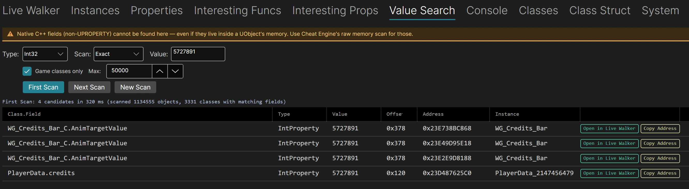

# UE5CEDumper
  

一套針對 Unreal Engine 4 & 5 遊戲的**執行期結構探查工具**、配合 Cheat Engine、可更方便的開發 Table。

UE5CEDumper 是一款UE資料的互動式的檢查工具。不同於其它 Dumper，它為遊戲記憶體提供了一個**即時視窗**，讓你能即時瀏覽物件、尋找實例，並匯出支援 Cheat Engine (CE) 的結構定義。

> 本工具為「實戰型」的 Table 製作人員打造，旨在消除UE物件的偵測、識別到在 CE 中的實作之間的鴻溝。

> 這並不是一般 Dumper、無法把大量資料倒出並分析，其集中在簡單找到 UE 結構，並和 CE 開發配合使用。故請視為是一個通用型的 UE 工具。

---

## 螢幕截圖 (Screenshots)
  
  

## 重點亮點 (Highlights)

快速了解你實際能用它做什麼（完整的 [Table 製作功能列表](#專為-table-製作人員設計的功能) 在下方）：

- **即時記憶體檢查** — 瀏覽遊戲物件、找出某類別的每個實例，並以即時數值深入 struct / class 佈局。
- **Value Search（數值搜尋）** — Cheat-Engine 風格的 First Scan / Next Scan，掃描每個 UE 屬性（數字、字串、向量、array / map / set），讓你不需知道 offset 就能找到要修改的目標。**Group 模式**可找出「同時持有多個數值」的物件（例如同一個 stats 區塊裡的 `Str + Def + Dex + Int`）— 比單值選擇性高得多；另有可選的 **Deep** 模式能深入巢狀容器找值。
- **Teleport（傳送）** — 將位置存入 3 個 marker 槽並隨後召回（BugItGo 風格），或在俯視 / 2.5D 遊戲中**傳送到滑鼠游標位置**。可自設全域熱鍵。也會讀取即時**相機 POV**（位置 / 旋轉 / FOV），讓你看出遊戲相機是跟著 pawn 還是獨立運作。¹
- **Debug Camera（除錯相機）** — 在內建此功能的遊戲中強制開 / 關自由飛行除錯相機（即使在通常會卡住的 Shipping build 也能可靠開關）。
- **Console（主控台）** — 發現並一鍵呼叫許多遊戲保留的 `fly` / `god` / `ghost` / 遊戲特定 cheat 指令。
- **一鍵 Cheat Engine 匯出** — 指標鏈 XML、Structure Dissect (CSX)、SDK headers、AA 腳本，以及多列 `.CT` 批次。
- **注入免 Cheat Engine** — 把 `version.dll` **proxy DLL** 放到遊戲旁，啟動後連接即可。

> ¹ Marker 存檔 / 召回廣泛可用（包含泰坦任務 2，已修正某些「回報成功卻不移動 actor」的引擎 setter 的 transform 重新整理問題）。少數被大量精簡的 Shipping build（例如泰坦任務 2）無法做*游標*傳送，因為它們移除了標準的游標 / viewport / line-trace API 並改用自訂虛擬游標 — 詳見 [docs/teleport-spec.md](docs/teleport-spec.md)。

## 實測版本矩陣 (Tested Version Matrix)

| UE 版本 | GObjects | GNames | DynOff | 已驗證遊戲 |
|---|:---:|:---:|:---:|---|
| **4.15 – 4.17** | ✅ | ✅ | ✅ | *Extinction* |
| **4.18 – 4.20** | ✅ | ✅ | ✅ | *Final Fantasy VII Remake Intergrade, The Occupation* |
| **4.21 – 4.24** | ✅ | ✅ | ✅ | *《STAR WARS 絕地：組織殞落™》, 勇者鬥惡龍 XI S, 偶像大師 星耀季節, 八方旅人, 勇者鬥惡龍 I&II / III HD-2D 重製版* |
| **4.25 – 4.27** | ✅ | ✅ | ✅ | *Final Fantasy VII Rebirth, Tower of Mask, 霍格華茲的傳承, 復活邪神 2 七英雄的復仇, Ghostwire: Tokyo, TimeSplitters Rewind (Early Access V0.3.3), The Artisan of Glimmith, Barn Finders, 機動戰士 GUNDAM SEED 激鬥命運 復刻版, 冒險家艾略特的千年奇譚 (The Adventures of Elliot: The Millennium Tales)* |
| **5.0 – 5.2** | ✅ | ✅ | ✅ | *Squirrel With A Gun, Caravan Sandwitch, Meltopia, Retro Rewind Demo* |
| **5.3 – 5.4** | ✅ | ✅ | ✅ | *Satisfactory (v1.1.3.1 滿意工廠), Colossal, Avowed (Obsidian — packed 20-byte FUObjectItem；static-struct GObjects AOB), 艾恩葛朗特 迴盪新聲 Demo (Echoes of Aincrad, Bandai Namco — dxgi.dll proxy)* |
| **5.5 – 5.7** | ✅ | ✅* | ✅** | *泰坦任務 2, EverSpace 2, Lushfoil Photography Sim, 莊園領主 (Manor Lords), Cat Island Petrichor Demo, Way of the Hunter 2 Demo, COMBAT PILOT: CARRIER QUALIFICATION Demo, Solarpunk (太陽龐克, stock UE5.7 — Object@+0x08), Satisfactory (滿意工廠 v1.2.3.1 — UE5.6；modular build，全域指標皆經 symbol export，217 K 物件)* |

*\*GNames 在 5.5+ 版本使用 .data 指標掃描回退機制。*
*\**DynOff 支援 **CasePreservingName (FName = 16 bytes)** 佈局。

---

## 專為 Table 製作人員設計的功能

| 功能 | 說明 |
|---|---|
| **AOB 掃描** | 整合來自 14+ 個來源的 128 組 AOB 特徵碼 + 5 組符號匯出。支援 `FChunkedFixed` 與 `FFixed` 物件陣列，並可偵測加密 GObjects 與預設佈局。**掃描提示快取 (Scan Hint Cache)** 記憶每款遊戲的中選特徵碼，重複掃描速度提升 3 倍，並提供 UI 按鈕清除/重設快取。 |
| **DynOff (動態偏移量)** | 執行時自動探測 `FField`、`FProperty` 與 `UStruct`。遊戲改版後不再需要手動更新偏移量。 |
| **Live Walker (即時檢視)** | 即時檢查實例的記憶體數據，數值變動一目瞭然。支援指標導航 (→)、內嵌結構展開 ({})、容器深入 ([])。瀏覽軌跡 (Breadcrumb) 完整記錄導航歷程。可設定自動重新整理間隔。 |
| **定義檢視 (Definition View)** | 深入 UScriptStruct/UClass 定義以查看欄位佈局、類型及即時 Hex 數值。與 CE XML 匯出無縫整合，支援指標鏈導航。 |
| **容器深入 (Container Drill-Down)** | 支援深入 **Array**、**Map**、**Set**、**Optional** 及委派容器。可解析 Object/Class/Weak/Soft/Lazy/Interface/Delegate/MulticastDelegate 內部型別，並支援點擊跳轉至目標物件。 |
| **位址查找 (Address Finder)** | 將 CE 抓到的位址貼入 Instance Finder → 採用 exact / contains / backward / nearest 分層匹配（並回傳 `match_kind` 信心標籤），同時可進行容器掃描，遍歷所有反射出來的 `TArray` / `TMap` / `TSet`（包含巢狀 `StructProperty`、深度 3）以找出擁有此位址的 UObject。 |
| **反向參照 (Find Refs)** | 「誰持有指向這個物件的指標？」掃描每個 UObject 的指標型欄位與容器，涵蓋直接 `Object/Class/Interface`、`Weak/Soft/Lazy`、`OptionalProperty<pointer/Struct>`、`Delegate` / `MulticastInline/MulticastDelegate`（每個綁定的 `FWeakObjectPtr`）、`TArray` 內部以上型別，以及 UObject 一側的 `TMap` / `TSet`。每個類別的 metadata 快取讓暖掃描在 1.18 M 物件遊戲上也只要 ~70 ms。**Open** 在 array/map/set element 命中時會自動 drill 進 `[N]` 元素，直接落在實際持有指標的那一格（無需再點一次）。 |
| **UFunction 呼叫器** | 直接從 UI 透過 `ProcessEvent` 呼叫遊戲函式。透過 MinHook 掛鈎實現遊戲執行緒安全調度。支援 ScriptStruct 參數 — 12 組已知引擎結構 (FVector, FRotator, FColor 等) + 動態結構佈局探索。**結構化回傳值 DataGrid**（build 775）將 FVector / FRotator / FHitResult / 使用者自訂 USTRUCT 的回傳結果以 Field / Type / Value / Offset 表格呈現於原有單行解碼之下。**參數 picker** 對指標參數會顯示預期 UClass 標籤（`[UObject*: AActor, 8B]`）+ `[Pick…] [null] [self]` 快速填入按鈕。 |
| **Value Search — 數值搜尋（依值掃描）** *(build 738 + Phase 2 757 + V1a 927)* | CE 風格 **First Scan / Next Scan** 工作流程，掃描每個 UPROPERTY 宣告欄位。**數值原始型別** (Int8/16/32/64 + UInt + Float / Double / Bool)：Exact / Bigger / Smaller / Between / Changed / Unchanged / Increased / Decreased + CE 風格 float 容差。**多寬度數值 meta**（`NumericNoByte` / `NumericAll`）一次掃過所有數值寬度，依每個欄位自己宣告的型別比對 — 不必事先知道值是以 int 還是 float 儲存（不會有 byte 重新解讀的偽命中）。**字串** (FString / FName / FText)：Contains / StartsWith / EndsWith + 可選的大小寫敏感比對。**向量** (FVector / FRotator)：`"X,Y,Z"` CSV 輸入 + per-axis 容差。**容器** — `TArray<T>`，以及 **`TSet<T>` 與 `TMap<K,V>` 的 key/value**，皆以元素為單位掃描（輸出 `Field[N]` / `Set[N]` / `Map.Key[N]` / `Map.Value[N]`），並有 10M 元素的軟性熔斷器。結果表格附**不分大小寫的關鍵字過濾**，以及可中止進行中掃描的 **Cancel** 按鈕。原生 C++ 欄位（非 UPROPERTY）刻意不在範圍內 — banner 會引導使用者改用 CE 原始記憶體掃描。Session 閒置 5 分鐘後自動失效。 |
| **Value Search — 多值群組掃描** *(build 1276；Deep 1283)* | object-aware 版的 Cheat Engine **Group Scan**：輸入 **2~4 個值**，找出「在不同 numeric property offset 同時持有全部這些值」（順序不限）的物件（例如同一個 stats 物件裡的 `Str + Def + Dex + Int`）。一次比對多個值的選擇性是相乘級的，上千筆候選收斂成個位數。結果為 **master-detail**：一列一物件，展開看各 slot 已定位的欄位（refine 收斂後以 🔒 標示已鎖定的 offset），每個 slot 沿用與單值命中相同的 Open-in-Live-Walker / Locate-in-GWorld / Copy handoff。可選的 **Deep（巢狀容器）** 切換（單值與 Group 皆適用）會額外走訪深層巢狀容器（struct 陣列、struct-valued map、巢狀 `TArray`/`TSet`），讓藏在如 `SaveSlotList[1].MsTuneData.MsTunes[0].WeaponTuneList[0].Tunes[N]` 裡的群組也能找到，並在**同一個 array 內**配對（每個數值陣列 / struct-array 元素各自一個配對 block）。底層為來源無關的 `Orden` 配對器，日後 Snapshot / SPC Query / Class Pivot 可重用同一套群組配對引擎。 |
| **屬性凍結（橫向類別範圍）** *(build 719)* | 一鍵凍結將屬性鎖在固定值，作用範圍涵蓋擁有類別的**所有作用中實例** — 透過 5 秒重新掃描計時器自動處理重生 / 新生成 / 銷毀。產生的 AA 腳本依賴 `ue5_freeze_helper.lua`（透過 AOBMaker 外掛自動注入到目前開啟的 CE table）。支援 BoolProperty / ByteProperty / Int8-64Property / UInt16-64Property / EnumProperty / FloatProperty / DoubleProperty。多個凍結腳本可透過 per-script 命名 handle table 共存。 |
| **興趣 Funcs + Properties 發現器** *(build 597 → 687)* | 兩個以評分驅動的發現分頁，依關鍵字 + 類別 + flag 啟發式對 UFunction 與屬性評分 — Stats / Inventory / Movement / Combat / Utility 分類，並對 Character/Pawn/PlayerController 等類別加分。CamelCase tokeniser 讓短縮寫（HP/MP/SP/XP/TP）能安全匹配。**Unusual Location** 旗標凸顯坐落於非典型容器（LocalPlayer / GameViewportClient / HUD / CheatManager）的 cheat 相關屬性。已透過 [`scripts/analysis/`](scripts/analysis/) 的離線分析器以 18 款遊戲跨遊戲 dump corpus 進行校準。 |
| **Console — UFUNCTION(exec) 發現 + 呼叫** *(build 731 + UCheatManager 提示 778)* | 列出遊戲中所有可達的 UFUNCTION(exec) 並提供一鍵呼叫。許多 cooked Shipping 遊戲都保留了 `fly` / `ghost` / `god` / `setspeed` 以及遊戲特定的 exec 進入點 — 遊戲作者已經為我們挑好了 cheat 入口。**UCheatManager 提示** 在所選 exec 的類別繼承自 `UCheatManager` 時警告 — 這些常被 Epic 以 `#if !UE_BUILD_SHIPPING` 移除函式內容（呼叫回傳 OK 但遊戲內無效果），提示會引導使用者改用遊戲特定的 exec 來驗證。 |
| **Teleport（BugIt 風格傳送）** *(build 1027 → 1112)* | 將玩家位置存入 **3 個 marker 槽位**並隨時召回，或在俯視 / 2.5D 遊戲中**傳送到滑鼠游標位置**（無游標的遊戲可回退至畫面中心）。完全以反射解析本地 pawn（無需 per-game offset），透過呼叫引擎自身的 `K2_SetActorLocation` / `K2_TeleportTo` / 元件層級 `K2_SetWorldLocation`（遊戲執行緒）移動；raw write 為最後手段。**BugItGo 互通** — 將目前姿態複製為 `BugItGo X Y Z` 字串，或貼上一段（含完整 `?BugLoc=…?BugRot=…` 形式）並執行。**唯讀相機 POV** *(build 1110-1112)* — 讀取螢幕上相機的位置 / 旋轉 / FOV（與 pawn 姿態不同），讓你判斷遊戲相機是跟著 pawn 還是獨立運作；使用引擎的 `APlayerCameraManager` getter，並對 getter 無回應的遊戲提供全反射的 `CameraCachePrivate.POV` 快取 fallback（已於 SEED、勇者鬥惡龍 III HD-2D、泰坦任務 2、八方旅人 驗證）。**使用者自設全域熱鍵** for Save/Recall（按鍵擷取、持久化）+ 自動綁定的 cursor 熱鍵，讓你能在遊戲取得焦點時觸發傳送。也能將動作匯出為瞬間觸發的 CE 記錄 / `.CT`。所有邏輯皆為 DLL 端、透過共享記憶體 mailbox 執行，因此產生的 CE 記錄只要注入 DLL 就能運作。 |
| **Debug Camera 強制開 / 關** *(build 1014)* | 可靠的自由飛行 debug camera 切換，即使在會 strip `DisableDebugCamera`、否則卡在自由飛行的 Shipping build 也有效。從 CheatManager 讀取即時狀態，當遊戲自身的 toggle 無法停用時，手動把本地玩家的 controller 切回原本的 PlayerController。版本無關（所有 offset 皆反射取得）。與 Teleport 共用同一條 DLL mailbox 路徑，UI **或**自包含 CE 腳本皆可使用。 |
| **多列 → 一個 .CT 批次產生器** *(build 760)* | 在 Interesting Funcs 或 Interesting Properties 用 Ctrl/Shift+click 選擇 N 列，點擊 📦 **Generate CT** 按鈕 → 儲存一個可直接分享的 `.CT` 檔，內含 per-row AA Script entry 並依分類分組。屬性列變成 Freeze entry；函式列變成 Baked Invoke entry。XML 跳脫所有特殊字元，描述中即使有 `TArray<int>` / `&` / 引號也不會破壞 CT 載入。 |
| **遊戲修補檔差異 (`diff_dumps.py`)** *(2026-05-27)* | 離線 Python 工具，比對同一款遊戲在兩個版本間的 `Dump All Metadata` JSONL 匯出。能找出 **欄位位移**（同名但 offset / size 不同）、型別變更、函式簽章變更，以及新增 / 移除的 class / property / function — 這些是沉默殺死現有 cheat table 的元兇。`--minimal` 只輸出會破壞既有 table 的變更。位於 [`scripts/analysis/diff_dumps.py`](scripts/analysis/diff_dumps.py)。 |
| **實例搜尋器** | 瞬間定位類別中所有作用中的實例。支援一鍵開啟 Live Walker 檢視。**類別雜訊過濾 (Class-noise filter)**（build 1444）— 過濾器依數量列出匹配到的類別（並附安全的引擎／系統類別**自動偵測**提示）；勾選某類別會在遊戲端**重新執行掃描，並在結果上限之前就於伺服器端排除它**，因此原本被擠到上限之外的實例（例如被數千個 `StaticMeshActor` 埋住）就能浮現 — 取消勾選或按 **Clear** 即可還原。另提供可調整的 **Max** 結果上限（100–50000），以及對已回傳列的暫時性**關鍵字過濾**（名稱／類別／位址，空白 = AND）。 |
| **屬性搜尋 (Property Search)** | 跨所有類別搜尋特定屬性名稱，無需瀏覽完整的物件階層。每列附 **Freeze** 按鈕（build 719），會產生在所有實例上鎖住欄位的 CE AA 腳本。 |
| **類別結構 (Class Structure)** | 瀏覽類別定義的完整欄位佈局、類型、偏移量及繼承鏈。 |
| **多格式 CE 匯出** | **CE XML** (指標鏈位址紀錄)、**CSX** (CE Structure Dissect)、**SDK Header** (.h)、**CE Field** (單一欄位)、**CE AA Script** (Auto Assembler)。支援純量、位元欄位、結構、陣列、Map/Set、OptionalProperty\<Struct\>、及 UEnum 下拉選單。**N 層指標 drill-down**（toolbar Drill Depth slider 0–4）— Copy CE Field 對 `ObjectProperty` 會跟著指標走進去，把目標物件的 UPROPERTY 以巢狀 `Offsets=[0]` 子節點輸出，貼到 CE 即可看到整個被引用物件的結構。**Soft array 每元素** 在 FSoftObjectPath 子位置輸出 FName leaf（UE4/5.0 單一 FName；UE5.1+ FTopLevelAssetPath PackageName + AssetName），不再只是 8B hex。**Collapse chain（壓平指標鏈）**（工具列開關）可選擇性地將整條 `GWorld → … → 目標` 指標跳轉壓成單一 CE 多階指標項 — `base` + 一個合併節點 + 目標欄位及其 drill-down — 讓深層導航路徑貼到 CE 時是精簡的多階指標，而非 N 層巢狀群組。 |
| **Proxy DLL** | Proxy-DLL 注入 — 不需要 Cheat Engine。將檔案放在遊戲 exe 旁，啟動遊戲後連接 UI 即可。三種劫持目標涵蓋各類遊戲：**`version.dll`**（最廣泛的預設）、**`dinput8.dll`**（手把 / DirectInput 遊戲），以及 **`dxgi.dll`**（每款 D3D11/D3D12 UE 遊戲都會匯入 — 對於*既不*匯入 version *也不*匯入 dinput8 的 EXE，例如某些 SQUARE ENIX build，是最可靠的目標）。Proxy Deploy 分頁會掃描 Steam、為每款遊戲部署所選類型，並僅在我們的兩種 proxy 真的同時存在時才警告。 |
| **現代化 UI** | 外部 **Avalonia UI** 透過高速具名管道連線（~50 組 JSON-RPC 指令）。各結果表格皆可排序。以 Native AOT 發佈，零 IL2026 / IL3050 警告。**長時間操作可乾淨取消** — 取消或關閉 UI 時操作會停止，注入的 DLL 不會空轉，遊戲永遠能立即關閉。確保遊戲執行效能不受影響。 |

---

## 架構與工作流程 (Architecture & Workflow)

### 方式 A：Cheat Engine 注入

1. **注入 DLL**: 開啟 Cheat Engine 附加遊戲，確保遊戲存檔已載入。開啟 `UE5CEDumper.CT`。
2. **啟用 CE 腳本**: 先啟用 `init <== enable after process attached`，再啟用 `Inject DLL + Start Pipe Server`。DLL 自動定位引擎全域指標，並偵測 UE 版本與記憶體佈局。
3. **連接 UI**: 等待數秒讓掃描完成。啟動 **UE5DumpUI.exe** 並點擊 **Connect**。即時數據透過具名管道 (Named Pipe, JSON-RPC) 串流至 UI。
4. **瀏覽及分析**: 瀏覽 `UObject` 階層，找到目標 Class，深入容器查看元素，或由 CE 中的位址反查並匯出。

### 方式 B：Proxy DLL（推薦，免 Cheat Engine）

1. **放置 DLL**: 將 `version.dll`（由 `build.ps1 -Target ProxyDLL` 產生）複製到遊戲根目錄（與 `.exe` 同層）。
2. **啟動遊戲**: 正常啟動遊戲。Proxy DLL 會自動載入並啟動管道伺服器。
3. **載入存檔**: 進入遊戲世界，確保 UE 物件已載入記憶體。
4. **連接 + 掃描**: 啟動 **UE5DumpUI.exe**，點擊 **Connect**，再點擊 **Start Scan**。DLL 執行 AOB 掃描並將引擎資料回傳至 UI。
5. **瀏覽及分析**: 與方式 A 相同 — 瀏覽物件、尋找實例、匯出 CE 結構。

> **注意**: 請勿同時使用兩種方式。若 Proxy DLL 已放在遊戲目錄中，請勿再透過 CE 注入 `UE5Dumper.dll`。DLL 會偵測重複實例並跳過自動啟動以避免衝突。

> **該用哪個 Proxy DLL？** 先試 `version.dll`（`build.ps1 -Target ProxyDLL`）。若遊戲能啟動但 UI 無法連接，通常代表該 EXE 沒有匯入 `version.dll` — 改試 **`dxgi.dll`**（`-Target ProxyDxgi`，每款 D3D11/D3D12 UE 遊戲都會匯入），或 `dinput8.dll`（`-Target ProxyDinput8`）。`build.ps1`（預設 `-Target All`）會把三種都建置到 `dist\proxy\`，而 **Proxy Deploy** 分頁可讓你為每款遊戲挑選類型並自動部署。

| **Game Process (Injected)** |
| :---: |
| DLL + CE Lua Bridge（或 Proxy DLL）|
| ⬇️ |
| **Named Pipe IPC (JSON-RPC Protocol)** |
| ⬇️ |
| **External GUI (Avalonia UI App)** |

---

### 選用：與 AOBMaker CE DLL 外掛整合

AOBMaker 是用於產生 AOB 特徵碼及 CE Auto Assembler 腳本的工具。它有一個 CE DLL 外掛可以與 UE5CEDumper 通訊，共享偵測到的特徵碼與偏移量。如果你已安裝 AOBMaker，可在 UE5CEDumper UI 中啟用整合功能：
- 直接由 UI 一鍵在 CE 中瀏覽記憶體區段或對應程式碼。
- 直接產生 CE AA 腳本（含動態 GWorld AOB AA 腳本）。
- 為 UE 型別與欄位產生 CE 記憶體紀錄。
- 為 UE 結構產生 dissect data 供 CE Structure Dissect 使用。

備註：AOBMaker 整合為選用，並非 UE5CEDumper 的必要條件。UE5CEDumper 的核心功能皆可獨立運作。

AOBMaker 下載連結（需先註冊）：https://opencheattables.com/viewtopic.php?t=1788

---

## 系統需求 (Requirements)

### 編譯環境 (Build)

| 工具 | 版本要求 |
|---|---|
| Visual Studio / MSVC | 2022 v17+ (MSVC v143) |
| CMake | 3.25+ |
| Ninja | 任何近期版本 |
| .NET SDK | 10.0 |

> `build.cmd` / `build.ps1` 會透過 `vswhere` 自動定位 MSVC，無需手動設定路徑。

### 執行環境 (Runtime)

- Windows 10/11 x64
- Cheat Engine 7.6+（CE 注入方式）*或* Proxy DLL（免 CE）
- 執行中的 Unreal Engine 4 或 5 遊戲作業程序 (x64)

---

## 重要注意事項 (Important Notes)

* **自定義數據結構**: 在如《FF7 Rebirth》等遊戲中，部分關鍵數據（如 HP）存儲在標準 `UObject` 之外的自定義結構中。Live Walker 可協助探查這些區域，但無法直接自動發現。
* **GWorld 連通性**: 截至 2026-06-17，`GWorld` 遍歷在 **100% 實測遊戲中正常運作（34 / 34）**，已涵蓋 Satisfactory（modular UE，獨立 `CoreUObject-Win64-Shipping.dll`）、《STAR WARS 絕地：組織殞落》(UE 4.21，EA 啟動器 / Steam)，以及 *Avowed*（其 `GWorld` AOB 落在誘餌位址，改以掃描 `.data` 尋找指向作用中遊戲世界的指標來回復 — 取 `OwningGameInstance` 非空的那個，並略過 World-Partition 的 `_Generated_` cell）。如遇尚未驗證的遊戲，請改用 **Object Tree** 或 **Instance Finder** 作為主要進入點。
* **EA 啟動器遊戲的 Proxy DLL 限制**: 《STAR WARS 絕地：組織殞落》透過 EA 啟動器啟動，`version.dll` 或 `dinput8.dll` proxy 皆無法被遊戲行程載入（EA 啟動器會限制 DLL 搜尋路徑）。需待遊戲啟動後改以 CE Dll Injection 注入。掃描端本身無問題 — DLL 進入行程後 GObjects / GNames / GWorld 均能正常解析。其他 EA 啟動器標題可能也有相同情況；若遇到請開 issue 回報。
* **針對既不匯入 `version.dll` 也不匯入 `dinput8.dll` 的遊戲使用 `dxgi.dll` proxy**: 少數遊戲（例如 *The Adventures of Elliot*，一款 SQUARE ENIX UE4.27 D3D12 demo；*Echoes of Aincrad Demo*，一款 Bandai Namco UE5.4 D3D12 遊戲）的 EXE 根本不匯入 `version.dll` 或 `dinput8.dll`，因此 Windows 永遠不會載入那些 proxy — 與 EA 的情況不同，這是遊戲自身的 import table，而非啟動器限制。請改用 **`dxgi.dll`** proxy（`build.ps1 -Target ProxyDxgi`，或在 Proxy Deploy 分頁選 *dxgi.dll*）：每款 D3D11/D3D12 UE 遊戲都會匯入 `dxgi`，因此能可靠載入。已在 Elliot 與 Echoes of Aincrad Demo 上端到端實測（連接 + 掃描 + 物件瀏覽）。
* **容器元素限制**: Array/Map/Set 的元素讀取受可調限制值控制，避免過度記憶體存取。如需處理大型容器，請在 Live Walker 中調整 **Array Limit** 滑桿。

---

## 專案貢獻 (Contributing)

請參閱 [CONTRIBUTING.md](CONTRIBUTING.md) 以瞭解：
- **回報偵測失敗** — 需要附上哪些日誌與資訊（最有幫助！）。
- **提交 AOB 特徵碼** — 給想直接貢獻的逆向工程者。
- **程式碼貢獻** — PR 流程與程式碼風格規範。

---

## 參考專案與致謝 (References & Credits)

| 專案 | 用途 |
|---|---|
| [Encryqed/Dumper-7](https://github.com/Encryqed/Dumper-7) | 動態偏移量偵測模式、FField/FProperty 探測策略 |
| [UE4SS-RE/RE-UE4SS](https://github.com/UE4SS-RE/RE-UE4SS) | UE5 執行時反射機制參考 |
| [Spuckwaffel/UEDumper](https://github.com/Spuckwaffel/UEDumper) | 即時編輯器 UI 架構參考 |
| [trumank/patternsleuth](https://github.com/trumank/patternsleuth) | GObjects/GNames 的額外 AOB 特徵碼 |
| [Do0ks/GSpots](https://github.com/Do0ks/GSpots) | GObjects/GNames 的 AOB 特徵碼 |
| [nlohmann/json](https://github.com/nlohmann/json) | DLL 使用的 JSON 函式庫 |
| [cheat-engine/cheat-engine](https://github.com/cheat-engine/cheat-engine) | CE Lua 腳本 API 參考 |
| **AOBMaker (內部工具)** | AOB 特徵碼產生工具，AA 腳本產生工具、快速 CE-goto 功能 (非必備) |
| UE4 Dumper.CT | Cake-san 的 Cheat Table — 額外的 UE4 AOB 特徵碼（Signatures.h 中的 CT 系列） |

---

## 使用 Claude Code 開發

本專案在 Anthropic 的 [Claude Code](https://claude.ai/code) 協助下開發。C++ DLL、C# Avalonia UI、建置腳本及文件均由開發者與 Claude Code 協作完成。

---

**授權條款**: [MIT](LICENSE) © 2026 bbfox0703